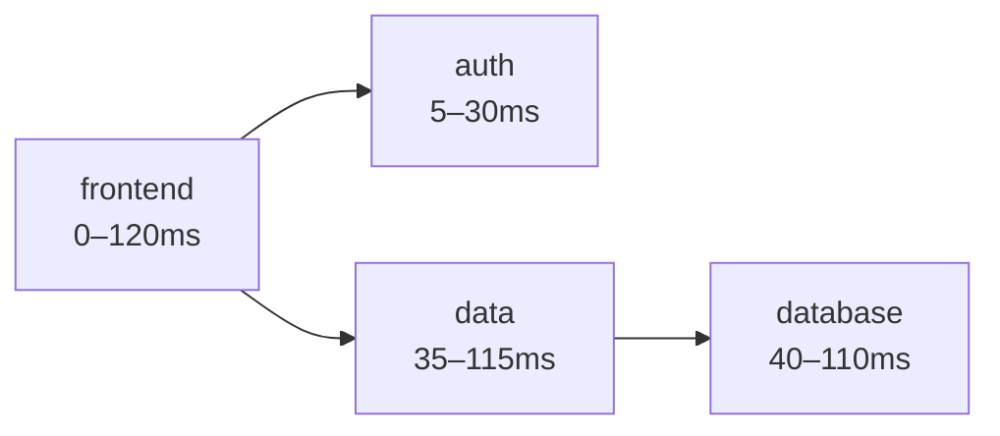

Introduction

---
## Some Heading

Some text
- This is an example presentation
- This is an example presentation
- This is an example presentation

Some text
- This is an example presentation
- This is an example presentation
- This is an example presentation

---
## Next Heading

Some text
- This is an example presentation
- This is an example presentation
- This is an example presentation

Some text
- This is an example presentation
- This is an example presentation
- This is an example presentation

---
## Next Heading

Some text
- This is an example presentation
- This is an example presentation
- This is an example presentation

Some text
- This is an example presentation
- This is an example presentation
- This is an example presentation

---
## Next Heading

Some text
- This is an example presentation
- This is an example presentation
- This is an example presentation

Some text
- This is an example presentation
- This is an example presentation
- This is an example presentation
