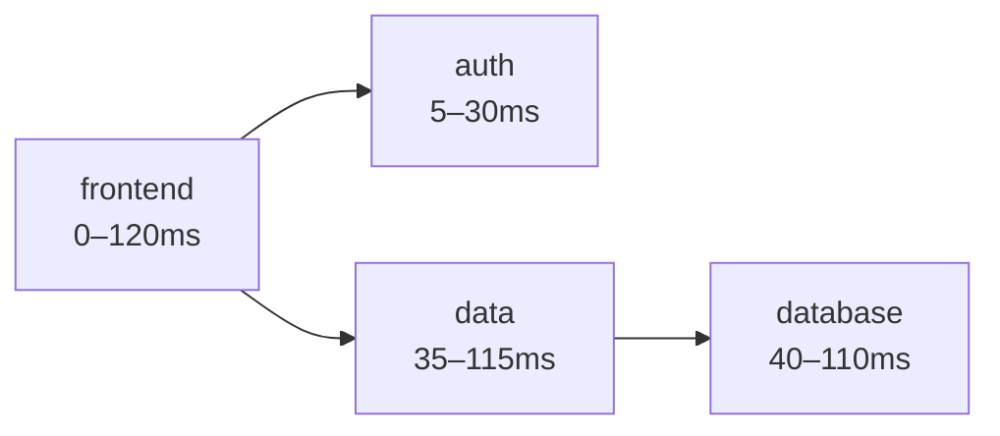
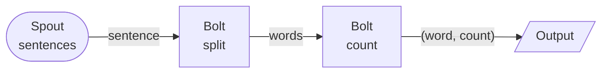

<!-- .slide: data-state="hide-menubar" -->
<div class="lecturetitle">Introduction</div>

---
## Table of Contents
<!-- .slide: data-state="hide-menubar" -->

<ul class="menu"><ul>

---
## Code Example

```bash
# Create a Kafka cluster using the operator
kubectl apply -f https://raw.githubusercontent.com/strimzi/strimzi-kafka-operator/refs/heads/main/examples/kafka/kafka-ephemeral.yaml
```

```bash
docker buildx build --platform linux/amd64,linux/arm64,linux/arm/v7 -t yourusername/yourcontainername:1.2.3 -t yourusername/yourcontainername:latest --push .
```

```bash
docker buildx build --platform linux/amd64,linux/arm64,linux/arm/v7 -t yourusername/yourcontainername:1.2.3 -t yourusername/yourcontainername:latest --push .
```
<!-- .element: data-no-wrap -->

---
## Kafka Streams: Run It

<pre class="dirtree" data-zipname="bla.zip" style="margin-left: 40px;">
00 - Introduction.md
test-code.c
</pre>

<pre class="dirtree" style="margin-left: 40px;">
00 - Introduction.md
test-code.c
</pre>

---
# Table

| Name         | Description                                                             |
| ------------ | ----------------------------------------------------------------------- |
| File sink    | Stores the output to a directory                                        |
| Kafka sink   | Stores the output to one or more topics in Kafka                        |
| Foreach sink | Runs arbitrary computation on each record                               |
| Console sink | Prints to stdout (debug only, collects data in driver program)          |
| Memory sink  | Stored as in-memory table (debug only, collects data in driver program) |

---
## Mermaid Example





Some text
- This is an example presentation
- This is an example presentation
- This is an example presentation

---
## Long Download List

<!-- 
	generate using 
	find code/use-case -type f -not -path '*/\.*' | grep -v node_modules | sort 
-->
<pre class="dirtree" data-zipname="use-case.zip"> 
code/use-case/k8s/kafka-topic.yaml
code/use-case/k8s/mariadb.yaml
code/use-case/k8s/memcached.yaml
code/use-case/k8s/spark-ingest.yaml
code/use-case/k8s/spark-prepare-silver.yaml
code/use-case/k8s/spark-recommender.yaml
code/use-case/k8s/spark-top10.yaml
code/use-case/k8s/web-app.yaml
code/use-case/spark-ingest/Dockerfile
code/use-case/spark-ingest/ingest.py
code/use-case/spark-prepare-silver/Dockerfile
code/use-case/spark-prepare-silver/prepare-silver.py
code/use-case/spark-recommender/Dockerfile
code/use-case/spark-recommender/entrypoint.sh
code/use-case/spark-recommender/recommender.py
code/use-case/spark-top10/Dockerfile
code/use-case/spark-top10/top10.py
code/use-case/web-app/Dockerfile
code/use-case/web-app/generate_insert_statements.js
code/use-case/web-app/index.js
code/use-case/web-app/package-lock.json
code/use-case/web-app/package.json
code/use-case/web-app/views/error.handlebars
code/use-case/web-app/views/home.handlebars
code/use-case/web-app/views/layouts/layout-main.handlebars
code/use-case/web-app/views/mission.handlebars
code/use-case/README.md
code/use-case/setup-kafka-and-bucket.sh
code/use-case/teardown-kafka.sh
code/use-case/skaffold.yaml
</pre>


---
## Asciinema Example

<asciinema data-conf='{ "cols": 120, "rows": 25, "theme":"monokai", "autoPlay": true, "idleTimeLimit": 2, "terminalFontSize": "16px"}'
        src="k8s-deployment.cast" />


---
## Some Heading
<!-- .slide: data-name="Some Heading" -->

Some text
- This is an example presentation
- This is an example presentation
- This is an example presentation

Some text
- This is an example presentation
- This is an example presentation
- This is an example presentation

<credits>This is a test for the credits section.</credits>

---
## Next Heading
<!-- .slide: data-name="next-heading" -->

Some text
- This is an example presentation
- This is an example presentation
- This is an example presentation

Some text
- This is an example presentation
- This is an example presentation
- This is an example presentation


---
## Next Heading

Some text
- This is an example presentation
- This is an example presentation
- This is an example presentation

Some text
- This is an example presentation
- This is an example presentation
- This is an example presentation
