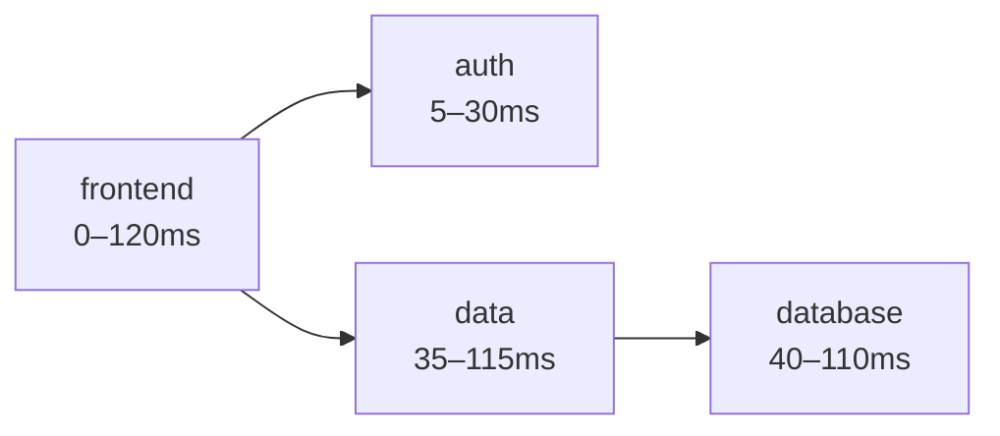

<!-- .slide: data-state="hide-menubar" -->
<div class="lecturetitle">Introduction</div>

---
## Table of Contents
<!-- .slide: data-state="hide-menubar" -->

<ul class="menu"><ul>

---
## Code Example

```bash
# Create a Kafka cluster using the operator
kubectl apply -f https://raw.githubusercontent.com/strimzi/strimzi-kafka-operator/refs/heads/main/examples/kafka/kafka-ephemeral.yaml
```

---
## Mermaid Example



Some text
- This is an example presentation
- This is an example presentation
- This is an example presentation

---
## Asciinema Example

<asciinema data-conf='{ "cols": 120, "rows": 25, "theme":"monokai", "autoPlay": true, "idleTimeLimit": 2, "terminalFontSize": "16px"}'
        src="k8s-deployment.cast" />


---
## Some Heading
<!-- .slide: data-name="Some Heading" -->

Some text
- This is an example presentation
- This is an example presentation
- This is an example presentation

Some text
- This is an example presentation
- This is an example presentation
- This is an example presentation

<credits>This is a test for the credits section.</credits>

---
## Next Heading
<!-- .slide: data-name="next-heading" -->

Some text
- This is an example presentation
- This is an example presentation
- This is an example presentation

Some text
- This is an example presentation
- This is an example presentation
- This is an example presentation


---
## Next Heading

Some text
- This is an example presentation
- This is an example presentation
- This is an example presentation

Some text
- This is an example presentation
- This is an example presentation
- This is an example presentation
